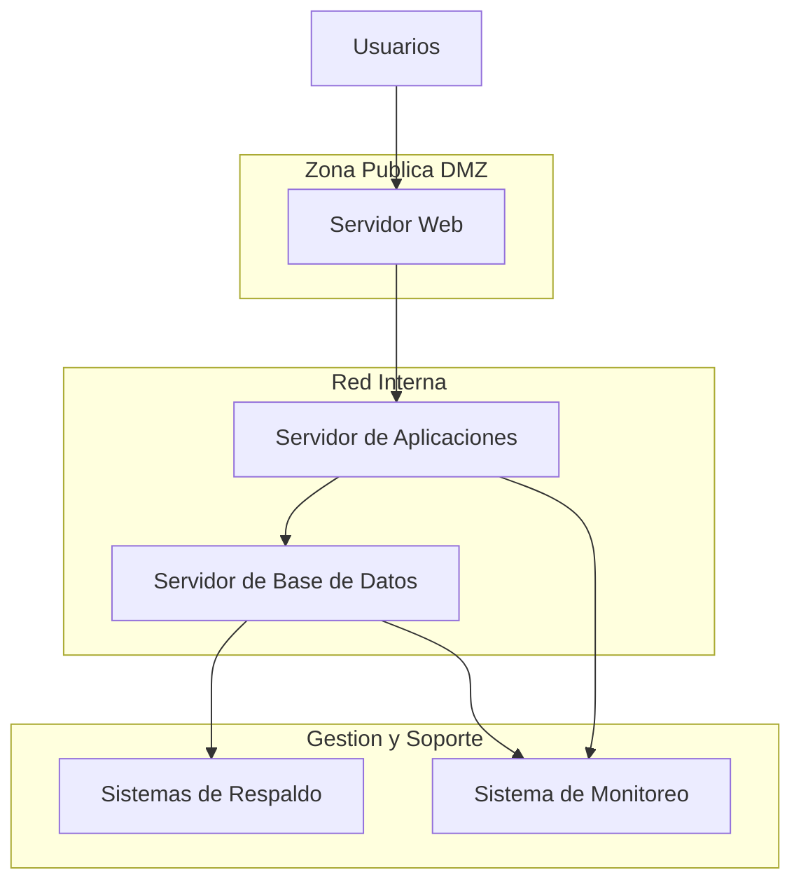

# Pr�ctica - Dise�o Conceptual de Infraestructura de Servidores
## Unidad 2: Infraestructura de servidores

## 1. Integrantes del grupo
- Nombre completo - Carnet'
- Nombre completo - Carnet'
- Nombre completo - Carnet'
- Nombre completo - Carnet'
- Nombre completo - Carnet 
---

## 2. Introducci�n

En este documento se presenta el dise�o conceptual de una infraestructura de servidores, elaborado a partir de requerimientos previamente analizados y priorizados.
El objetivo es proponer una arquitectura l�gica de alto nivel que permita visualizar los componentes necesarios y su relaci�n, sin considerar marcas, modelos ni configuraciones espec�ficas.

---

## 3. Requerimientos considerados

A continuaci�n se listan los requerimientos del negocio que se tomaron como base para el dise�o conceptual.

### Requerimiento 1
**Descripci�n:**  

### Requerimiento 2
**Descripci�n:**  

---

## 4. Identificaci�n de servidores por rol

A partir de los requerimientos, se identifican los siguientes roles de servidores:

| Requerimiento | Rol del servidor | Justificaci�n |
|--------------|-----------------|---------------|
| Req. 1 | | |
| Req. 2 | | |

> Ejemplo de roles: Servidor Web, Servidor de Aplicaciones, Servidor de Base de Datos.

---

## 5. Dise�o conceptual de la arquitectura

### 5.1 Organizaci�n por capas

Describa c�mo se organiza la infraestructura en capas:

- **Capa de Presentaci�n:**  
- **Capa de Aplicaci�n:**  
- **Capa de Datos:**  

Indique qu� componentes se consideran expuestos y cu�les permanecen en la red interna.

---

## 6. Diagrama l�gico de infraestructura

Diagrama conceptual de la infraestructura.

